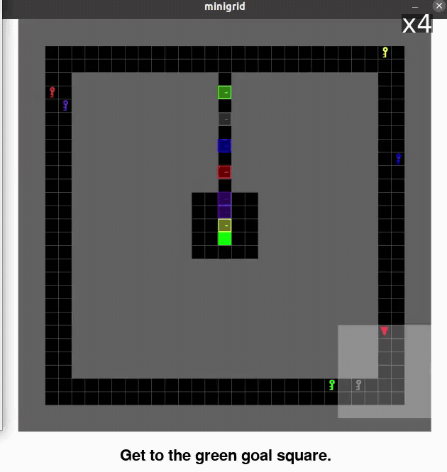
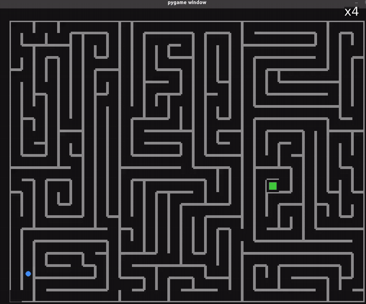

# COvolve

## Adversarial Co-Evolution of LLM-Generated Policies and Environments

[](https://doi.org/10.1145/3795095.3805144)
[](https://doi.org/10.1145/3795095.3805144)
[](#released-artifacts)

Official repository for:

> **COvolve: Adversarial Co-Evolution of Large-Language-Model-Generated Policies and Environments via Two-Player Zero-Sum Game**  
> Alkis Sygkounas, Rishi Hazra, Andreas Persson, Pedro Zuidberg Dos Martires, and Amy Loutfi  
> Genetic and Evolutionary Computation Conference — **GECCO 2026**

COvolve is an LLM-driven co-evolutionary framework in which both **policies** and **environments** are generated as executable Python code.

An Environment Designer searches for environments that expose weaknesses in the current policy population. A Policy Designer responds by generating policies capable of solving the new challenges. Their interaction is formulated as a **two-player zero-sum game**, while a **mixed-strategy Nash equilibrium (MSNE)** produces a robust meta-policy over the evolving policy archive.

The result is an automatically generated curriculum in which environments become progressively more challenging while policies adapt without forgetting previously solved tasks.

---

## Demonstrations

The previews below show policies produced by COvolve in the three experimental domains. Click a preview to open the complete MP4 video.

<table>
<tr>
<td align="center" width="33%">
<a href="media/minigrid_gpt_5_2_4x.mp4">

</a>
<br>
<strong>MiniGrid</strong>
<br>
Symbolic maze solving
</td>

<td align="center" width="33%">
<a href="media/pygame_gpt5_2_4x.mp4">

</a>
<br>
<strong>PyGame</strong>
<br>
Continuous geometric navigation
</td>

<td align="center" width="33%">
<a href="media/carla_gpt_5_2.mp4">

</a>
<br>
<strong>CARLA</strong>
<br>
Urban autonomous driving
</td>
</tr>
</table>

---

## Motivation

Training environments are commonly fixed, manually designed, or sampled from a predefined distribution. This restricts continual learning because the agent cannot actively obtain new tasks that target its current weaknesses.

Classical unsupervised environment design can generate adaptive curricula, but its environment-generation mechanisms are often based on randomization or restricted parameterizations.

COvolve instead uses the code-generation capabilities of large language models to construct:

- complete environments;
- complete executable policies;
- new task structures;
- new policy mechanisms;
- increasingly difficult curriculum stages.

The environment and policy generators are connected in a closed adversarial loop rather than being optimized independently.

---

## Framework

COvolve maintains two growing populations:

- an environment population  
  \(\mathcal{L}=\{\theta_0,\theta_1,\ldots,\theta_k\}\);
- a policy population  
  \(\mathcal{P}=\{\pi_0,\pi_1,\ldots,\pi_k\}\).

Every policy is evaluated on every environment to construct an empirical payoff matrix:

```math
M_{ij}=U_{\theta_j}(\pi_i),
```

where \(U_{\theta_j}(\pi_i)\in[0,1]\) is the policy success rate on the corresponding environment.

In the main experiments, each policy–environment payoff is estimated over **100 evaluation episodes**.

### 1. Mixed-strategy policy

COvolve computes a mixed-strategy Nash equilibrium over the empirical policy–environment game.

The resulting distribution \(p^\star\) assigns probabilities to policies in the archive so that the mixture maximizes its worst-case performance over the current environment set.

```math
p^\star
\in
\arg\max_{p\in\Delta(\mathcal{P})}
\min_{\theta_j\in\mathcal{L}}
\sum_i p_i M_{ij}.
```

A policy is sampled from this distribution at the beginning of an episode. The resulting mixture is the COvolve **meta-policy**.

### 2. Environment best response

The Environment Designer receives the current environment and the MSNE policy mixture.

It generates multiple executable environment mutations and selects the candidate that minimizes the expected success of the equilibrium policy mixture.

The selected environment therefore targets weaknesses that remain in the current policy population.

### 3. Policy best response

The Policy Designer receives the newly selected environment and generates multiple executable policy mutations.

The highest-performing candidate becomes an approximate best response to the new environment and is added to the policy archive.

### 4. Co-evolution

The selected environment and policy are appended to their respective populations. The payoff matrix is expanded, a new equilibrium is computed, and the process repeats.

```text
Policy archive + environment archive
                  │
                  ▼
        Evaluate every policy–environment pair
                  │
                  ▼
          Construct empirical payoff matrix
                  │
                  ▼
        Compute MSNE policy distribution
                  │
                  ▼
    Environment Designer generates a challenge
                  │
                  ▼
       Policy Designer generates a response
                  │
                  ▼
       Add both to their growing archives
                  │
                  └──────────── repeat
```

All main experiments use **GPT-5.2** for both environment and policy generation.

---

## Why the MSNE matters

A policy optimized only for the latest environment can forget how to solve earlier environments.

COvolve compares three population-selection strategies:

| Strategy | Policy used during evaluation |
|---|---|
| **UED-Greedy** | Uses only the latest generated policy |
| **UED-Uniform** | Samples uniformly from all policies generated so far |
| **COvolve** | Samples according to the optimized MSNE distribution |

The MSNE does not simply retain every policy equally. It assigns probability to policies according to how they complement each other across the environment archive.

When the latest policy loses performance on earlier environments, the equilibrium can restore probability to an earlier policy that still solves those environments. This improves robustness and reduces catastrophic forgetting.

---

## Experimental domains

### MiniGrid — symbolic maze solving

MiniGrid evaluates discrete symbolic planning.

The agent must navigate to a goal while handling structures such as walls, locked doors, keys, and narrow passages.

Difficulty increases through:

- larger grids;
- greater obstacle density;
- longer navigation paths;
- sequential key–door dependencies;
- hard and soft chokepoints;
- keys that must be collected in the correct order.

The most difficult evolved environments contain multiple sequential dependencies and constrained geometries that are more complex than the standardized MiniGrid tasks used for generalization evaluation.

### PyGame — geometric 2D navigation

The PyGame domain evaluates continuous control and geometric reasoning.

A circular agent must reach a rectangular target while avoiding fixed obstacles.

Difficulty increases through:

- denser obstacle arrangements;
- narrow traversable passages;
- deceptive routes;
- constrained turning spaces;
- obstacle configurations requiring precise continuous actions.

### CARLA — urban autonomous driving

CARLA evaluates policy generation in a partially observable, dynamic urban-driving environment.

The policy receives compact information about:

- vehicle kinematics;
- nearby vehicles;
- pedestrians;
- traffic lights;
- relevant road geometry.

Difficulty increases through:

- denser urban traffic;
- pedestrian activity;
- abrupt braking;
- adversarial vehicles;
- traffic-light violations by other actors;
- increasingly unpredictable multi-agent interactions.

The task requires completing the route while avoiding collisions, obeying traffic rules, and adapting to adversarial behavior.

---

## Main results

### Policy–environment co-evolution

The result figures compare:

- the complete policy–environment payoff matrix;
- the latest policy \(\pi_{\text{last}}\);
- the best single archive policy \(\pi_{\arg\max}\);
- the COvolve MSNE policy mixture;
- UED-Greedy;
- UED-Uniform.

| Domain | Main result figure |
|---|---|
| MiniGrid | [MSNE, latest policy, and best single policy](media/minigrid_msne_vs_pi_vs_argmax_seed1.pdf) |
| CARLA | [MSNE, latest policy, and best single policy](media/carla_seed_1_msne_last_vs_pi_last_vs_pi_argmax.pdf) |
| PyGame | [Policy–environment performance matrix](media/pygame_seed1_pi_vs_env.pdf) |

The experiments show that:

1. COvolve generates progressively more challenging environments.
2. The latest policy often specializes to the newest environment and loses performance on earlier tasks.
3. A uniform policy mixture is not sufficient because it assigns equal probability to useful and redundant policies.
4. The MSNE mixture maintains stronger performance across the complete environment archive.
5. When the equilibrium is non-trivial, COvolve outperforms the latest-policy-only strategy on the accumulated curriculum.

Click each link to open the corresponding full-resolution PDF.

---

## Generalization to unseen environments

Policies are also evaluated on standardized environments that were not encountered during co-evolution.

For MiniGrid, evaluation uses:

- `MiniGrid-MultiRoom-N6-v0`;
- `MiniGrid-DoorKey-16x16-v0`;
- `MiniGrid-LockedRoom-v0`.

For CARLA, evaluation uses:

- `Town02`, which was not used during co-evolution.

Results show mean ± standard deviation across two evolutionary seeds, with 100 evaluation episodes per seed.

| Unseen environment | UED-Greedy | UED-Uniform | COvolve |
|---|---:|---:|---:|
| MiniGrid-MultiRoom-N6-v0 | **1.00 ± 0.00** | 0.86 ± 0.06 | **1.00 ± 0.00** |
| MiniGrid-DoorKey-16x16-v0 | **1.00 ± 0.00** | 0.62 ± 0.24 | **1.00 ± 0.00** |
| MiniGrid-LockedRoom-v0 | **1.00 ± 0.00** | 0.66 ± 0.16 | **1.00 ± 0.00** |
| CARLA Town02 | 0.62 ± 0.09 | 0.13 ± 0.06 | **0.71 ± 0.05** |

No standardized external benchmark with the same task structure was available for the custom PyGame domain, so separate PyGame generalization results are not reported.

---

## Is the progressive curriculum necessary?

COvolve includes a zero-shot ablation in which the LLM attempts to generate a policy directly for the hardest evolved environment without seeing the intermediate curriculum.

Starting from the initial policy, the LLM is given the same number of mutation opportunities as in the complete co-evolutionary process.

The zero-shot procedure consistently fails to match policies produced through the progressive curriculum. This indicates that the sequence of intermediate environments is important: the LLM cannot reliably jump directly from the initial policy to a solution for the final task.

### Zero-shot curriculum ablations

- [Ablation case 1](media/ablation_zero_msne0_msne9_case1.pdf)
- [Ablation case 2](media/ablation_zero_msne0_msne9_case2.pdf)
- [Ablation case 3](media/ablation_zero_msne0_msne9_case3.pdf)

These plots compare direct generation on the hardest environment against policies obtained through the full COvolve curriculum.

---

## Released artifacts

The `Results` directory contains the released policy and environment code artifacts for each experimental domain.

For each domain, the repository provides:

- the hardest selected evolved environment;
- the corresponding best evolved policy.

| Domain | Hardest evolved environment | Best evolved policy |
|---|---|---|
| CARLA | [Environment code](Results/carla/env/env.txt) | [Policy code](Results/carla/policy/policy.txt) |
| MiniGrid | [Environment code](Results/minigrid/env/env.txt) | [Policy code](Results/minigrid/policy/policy.txt) |
| PyGame | [Environment code](Results/pygame/env/env.txt) | [Policy code](Results/pygame/policy/policy.txt) |

Both environments and policies are represented as human-readable executable Python programs. They are stored as `.txt` files so that their complete generated logic can be inspected directly through GitHub.

---

## Repository structure

```text
.
├── README.md
│
├── Results/
│   ├── carla/
│   │   ├── env/
│   │   │   └── env.txt
│   │   └── policy/
│   │       └── policy.txt
│   │
│   ├── minigrid/
│   │   ├── env/
│   │   │   └── env.txt
│   │   └── policy/
│   │       └── policy.txt
│   │
│   └── pygame/
│       ├── env/
│       │   └── env.txt
│       └── policy/
│           └── policy.txt
│
└── media/
    ├── carla_gpt_5_2.mp4
    ├── carla_gpt_5_2_preview.gif
    ├── carla_seed_1_msne_last_vs_pi_last_vs_pi_argmax.pdf
    │
    ├── minigrid_gpt_5_2_4x.mp4
    ├── minigrid_gpt_5_2_preview.gif
    ├── minigrid_msne_vs_pi_vs_argmax_seed1.pdf
    │
    ├── pygame_gpt5_2_4x.mp4
    ├── pygame_gpt5_2_preview.gif
    ├── pygame_seed1_pi_vs_env.pdf
    │
    ├── ablation_zero_msne0_msne9_case1.pdf
    ├── ablation_zero_msne0_msne9_case2.pdf
    └── ablation_zero_msne0_msne9_case3.pdf
```

---

## Key conclusions

1. **LLMs can co-evolve both environments and policies as executable code.**

2. **Adversarial environment generation creates an automatic curriculum that targets weaknesses in the current policy population.**

3. **Progressive curriculum construction is necessary:** direct policy generation on the hardest environments consistently fails.

4. **The latest policy alone is not robust:** specialization to new environments can cause forgetting on earlier tasks.

5. **The MSNE meta-policy preserves population-level robustness** by selecting complementary policies from the archive.

6. **The resulting policies generalize to unseen standardized tasks**, including MiniGrid benchmarks and CARLA Town02.

---

## Paper

**COvolve: Adversarial Co-Evolution of Large-Language-Model-Generated Policies and Environments via Two-Player Zero-Sum Game**

Alkis Sygkounas, Rishi Hazra, Andreas Persson, Pedro Zuidberg Dos Martires, and Amy Loutfi.

Genetic and Evolutionary Computation Conference, GECCO 2026.

- [ACM Digital Library and DOI](https://doi.org/10.1145/3795095.3805144)

---

## Citation

If you use COvolve or the released artifacts, please cite:

```bibtex
@inproceedings{sygkounas2026covolve,
  title     = {{COvolve}: Adversarial Co-Evolution of Large-Language-Model-Generated Policies and Environments via Two-Player Zero-Sum Game},
  author    = {Sygkounas, Alkis and
               Hazra, Rishi and
               Persson, Andreas and
               Zuidberg Dos Martires, Pedro and
               Loutfi, Amy},
  booktitle = {Proceedings of the Genetic and Evolutionary Computation Conference},
  year      = {2026},
  publisher = {Association for Computing Machinery},
  doi       = {10.1145/3795095.3805144}
}
```

---

## Acknowledgements

This work is supported by the Knut and Alice Wallenberg Foundation through the Wallenberg AI, Autonomous Systems and Software Program and the Wallenberg Scholars Grant.

Computational resources were provided by the National Academic Infrastructure for Supercomputing in Sweden through the LUMI supercomputer.
